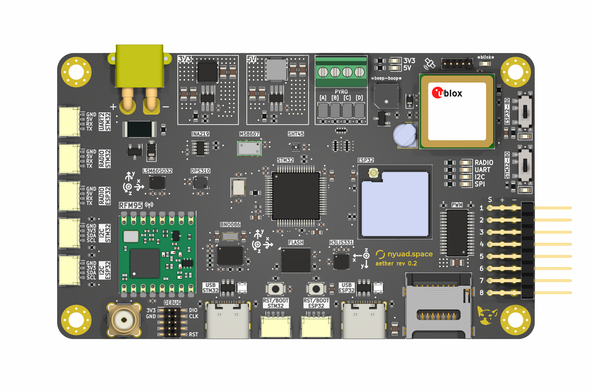

# Aether: Flight Computer

## Overview

Aether is a multifunctional flight computer designed as an adaptable testbed for a variety of flight hardware and software components. The primary objective of this project is to evaluate external sensors and various algorithmic approaches, with a specific focus on sensor fusion techniques. These techniques aim to extract essential data regarding the rocket's states throughout its flight. The flight computer is equipped with the capability to interface with on-board rocket hardware, including deployment mechanisms.

## Key Features

- **Sensor Evaluation:** Aether serves as a platform for evaluating external sensors, with a particular emphasis on sensor fusion techniques.

- **Algorithmic Exploration:** The project explores various algorithmic approaches to extract crucial data about the rocket's states during its flight.

- **Hardware Interface:** The flight computer is designed to interface seamlessly with on-board rocket hardware, facilitating communication and control, especially with deployment mechanisms.

- **Dual Microcontroller Units:** Aether incorporates two microcontroller units (MCUs), each specialized for distinct tasks. One MCU is dedicated to data sampling, while the other focuses on communication with the ground station.

## Microcontrollers on Board

| Microcontroller         |
|-------------------------|
| STM32F405RGTx           |
| ESP32-S3-MINI-1U-N8     |

## Components on Board

| Component                                         | Interface |
|------------------------------------------------|-----------|
| TE MS8607 PHT Sensor                           | I2C       |
| DPS310 Precision Barometric Pressure and Altitude Sensor | I2C, SPI  |
| H3LIS331 Ultra High Range Triple-Axis Accelerometer | I2C, SPI  |
| LSM6DSO32 6-DoF Accelerometer and Gyroscope    | I2C, SPI  |
| Sensirion SHT45 Precision Temperature & Humidity Sensor | I2C       |
| SAM M10Q (GPS)                                       | I2C       |
| RFM 95 HCW (LoRa Transceiver)                                | SPI       |
| W25Q128JVSIQ (Flash)                           | SPI       |

## Project Link

View this project on [CADLAB.io](https://cadlab.io/project/27167) for additional details, documentation, and collaborative contributions.

Feel free to explore, contribute, and adapt Aether as needed for your specific flight hardware and software requirements.
